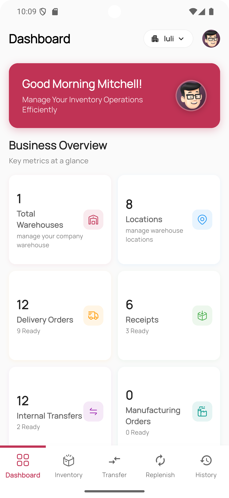
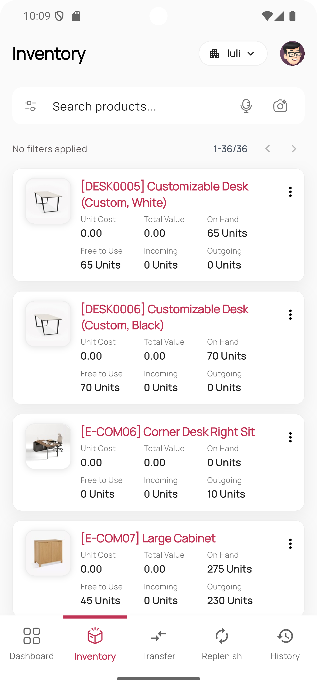
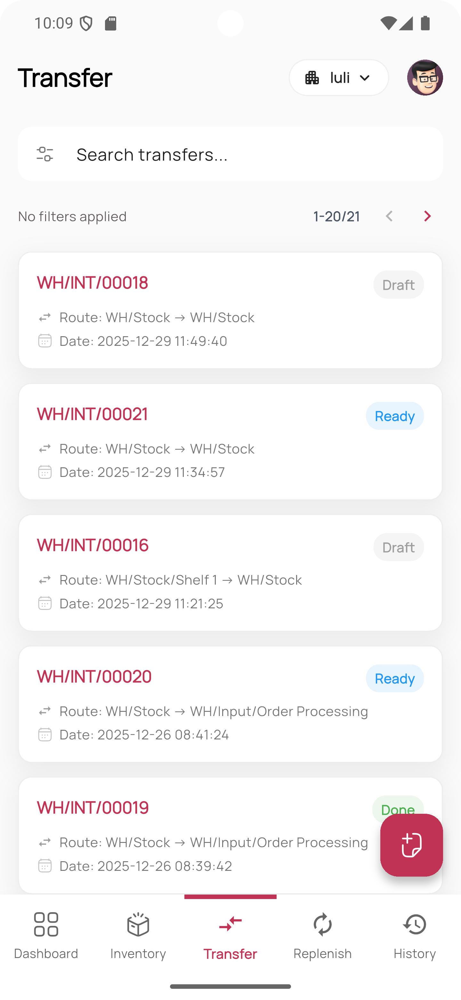
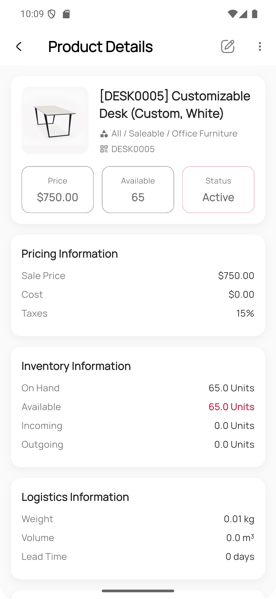

# Mobo Inventory


Mobo Inventory is a robust mobile solution designed to seamlessly integrate with Odoo, empowering businesses to manage their warehouse operations with efficiency and precision. Built with Flutter, it offers a high-performance, intuitive interface for tracking stock, managing replenishments, and overseeing manufacturing processes directly from your mobile device.

##  Key Features

###  Comprehensive Inventory Management
- **Real-Time Stock Tracking**: Monitor stock levels across multiple locations and warehouses instantly.
- **Product Management**: View detailed product information, sales history, and make quick edits to product details on the go.
- **Stock Moves**: Full audit trail of all inventory movements for complete transparency.

###  Manufacturing & Production
- **Production Overview**: distinct view for manufacturing orders, grouped by status or date.
- **Order Tracking**: Keep track of production progress and ensure timely fulfillment.
- **Smart Filtering**: Advanced filtering options to quickly locate specific production orders.

###  Advanced Replenishment
- **Automated Workflows**: Trigger manual or automated replenishment rules directly from the app.
- **Smart Order Points**: Edit minimum and maximum stock rules to optimize inventory levels.
- **Snooze Functionality**: Temporarily snooze replenishment alerts for specific items.

###  Transfers & Logistics
- **Seamless Transfers**: Create and manage internal transfers, receipts, and delivery orders.
- **Operation Types**: Support for various picking operation types.
- **Detailed Forms**: Comprehensive forms for accurate data entry during transfer operations.

###  Security & User Experience
- **Biometric Authentication**: Secure and fast login using fingerprint or Face ID.
- **2-Factor Authentication (2FA)**: Support for Time-based One-Time Password (TOTP) for enhanced security.
- **User Access Control**: Permission-based access governed by Odoo's user group settings.
- **Switch Account**: Quickly swap between multiple Odoo accounts and databases.
- **Multi-Company Support**: Easily switch between different company profiles.
- **Dark Mode**: Fully optimized dark theme for comfortable usage.
- **Performance**: Optimized with pagination and domain-based filtering for large datasets.

##  Screenshots


<div>
  
  
  
  
</div>


##  Technology Stack

Mobo Inventory is built using modern technologies to ensure reliability and performance:

- **Frontend**: Flutter (Dart)
- **State Management**: Provider
- **Local Database**: Isar (High-performance NoSQL database)
- **Backend Integration**: Odoo RPC
- **Navigation**: GoRouter
- **Authentication**: Local Auth (Biometrics) & Odoo Session Management
- **Reporting**: PDF & Printing capabilities

##  Supported Odoo Versions

Tested and verified on:
- **Odoo version 17 - 19** (Community & Enterprise)

##  Getting Started

### Prerequisites
- Flutter SDK (Latest Stable)
- Odoo Instance (v17 or higher recommended)
- Android Studio or VS Code

### Installation

1. **Clone the repository**
   ```bash
   git clone https://github.com/mobo-open-source/mobo_inventory.git
   cd mobo_inv_app
   ```

2. **Install dependencies**
   ```bash
   flutter pub get
   ```

3. **Generate code bindings**
   Run the build runner to generate necessary code for Isar and JSON serialization:
   ```bash
   dart run build_runner build --delete-conflicting-outputs
   ```

4. **Run the application**
   ```bash
   flutter run
   ```

##  Usage

To get started with Mobo Inventory:

1. **Open the App**: Launch Mobo Inventory on your mobile device.
2. **Setup Server**: Enter your Odoo server URL.
3. **Select Database**: Choose the appropriate database for your company.
4. **Login**: Enter your Odoo credentials (including 2FA if enabled).
5. **Start Managing**: Begin managing your inventory and warehouse operations efficiently.

##  Roadmap

Future improvements planned for Mobo Inventory:
- [ ] **Offline Support**: Enable work without internet with automatic synchronization.
- [ ] **Barcode Scanning**: Integrated barcode and QR code scanning for quick product lookup and stock moves.
- [ ] **AI Support**: Intelligent stock predictions and optimized replenishment suggestions.

##  Contributing

We welcome contributions to improve Mobo Inventory!
1. Fork the project.
2. Create your feature branch (`git checkout -b feature/NewFeature`).
3. Commit your changes (`git commit -m 'Add NewFeature'`).
4. Push to the branch (`git push origin feature/NewFeature`).
5. Open a Pull Request.

##  Maintainers

**Team Mobo at Cybrosys Technologies**
-  [mobo@cybrosys.com](mailto:mobo@cybrosys.com)

## License

This project is primarily licensed under the Apache License 2.0.
It also includes third-party components licensed under:
- MIT License
- GNU Lesser General Public License (LGPL)

See the [LICENSE](LICENSE) file for the main license and [THIRD_PARTY_LICENSES.md](THIRD_PARTY_LICENSES.md) for details on included dependencies and their respective licenses.
